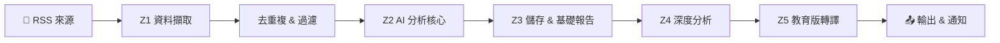

# 🤖 AI 深度情報分析報告 — 成人教學版

> 本報告將「分析師版」的深度分析結果，轉譯為不需要技術背景即可理解的版本。
> 適合：產品經理、投資人、管理層、或任何對科技趨勢好奇的讀者。

## 📋 封面資訊

| 項目 | 內容 |
|------|------|
| 報告時間 | 2026-02-13 09:22 本機時區 |
| Run ID | `2b8233127a3e` |
| 分析項目數 | 2 則（有效 2、無效 0）|
| 全文抓取成功率（Enrich Success Rate） | 80% |
| 總執行時間 | 34.4 秒 |
| 主要失敗原因 | 全文抽取品質不足（網頁內容過少或格式特殊，無法擷取完整文章）（2 次）; 被目標網站封鎖（對方的反爬蟲機制阻止了我們的存取）（1 次）; 網路連線失敗（可能是 DNS 解析錯誤、連線逾時或伺服器無回應）（1 次） |

**📖 閱讀指南：**

1. **先看**：「今日結論」— 2 分鐘掌握全貌
2. **再看**：「每則新聞卡片」— 深入了解每則事件的背景與影響
3. **最後看**：「Metrics 與運維建議」— 了解系統狀態與改善方向

---

## 📊 今日結論（Executive Summary）

本次分析共處理 2 則資料項目，其中 **2 則為有效新聞**。

有效新聞涵蓋的主題包括：The BoringSSL a、In a move that 。

本批次資料可信度**良好**，大部分項目成功完成全文抽取與分析。

| 指標 | 數值 |
|------|------|
| 有效項目 | 2 則 |
| 無效項目 | 0 則 |
| 主要來源 | （未記錄） |
| 主要主題 | （未分類） |

---

## ❓ 這套系統到底在做什麼（QA）

**Q1：這份報告的輸入是什麼？**

系統從多個 RSS 來源（如 TechCrunch、36kr、Hacker News）自動擷取最新文章。每篇文章經過全文抓取後，成為一個「資料項目（Item）」，也就是本報告的分析對象。

**Q2：輸出是什麼？**

系統產出四種文件：① `digest.md`（快速摘要）、② `deep_analysis.md`（分析師版深度報告）、③ 本份教育版報告、④ 選配的通知推送（Slack/飛書/Email）。每份文件服務不同讀者。

**Q3：什麼是 Pipeline（資料處理管線）？**

Pipeline 就像一座「資料工廠」的生產線。原始新聞從入口進來，依序經過清洗、分類、評分、深度分析等站點，最終產出結構化的報告。每個站點專責一項任務，如果某站出錯，不會影響其他站的運作。在資料工程領域，這種模式稱為 ETL（Extract-Transform-Load），是最常見的自動化資料處理架構。

**Q4：為什麼要打分數？分數代表什麼？**

系統會為每則新聞計算一個綜合分數（final_score），考量新穎性、實用性、熱度、可行性等維度。只有分數超過門檻（預設 7.0）的項目才會進入深度分析階段。這個機制稱為「品質門檻（Quality Gate）」，目的是把有限的運算資源集中在最有價值的內容上。

**Q5：為什麼會出現「不是新聞的字串」？**

自動化抓取時，部分網站會要求登入、顯示 Cookie 通知、或回傳 Session 過期的提示頁面。這些頁面會被抓取程式當成文章內容。本報告中，這類項目會被標記為「⚠️ 非新聞內容」，並提供具體的修復建議。

**Q6：我今天要做的最小動作是什麼？**

1. 花 2 分鐘讀完「今日結論」
2. 挑 1 則你最感興趣的新聞卡片仔細閱讀
3. 按照卡片中的「可執行行動」完成 1 個任務

---

## 🗺️ 系統流程圖



**各站說明：**

- **Z1 資料擷取（Ingestion）**：從 RSS 來源抓取文章，進行全文擷取與基本清洗。白話說：「把網路上的原始新聞抓下來」。
- **Z2 AI 分析核心（AI Core）**：對每則新聞做摘要、分類、評分、實體抽取。白話說：「讓 AI 讀完每篇文章並寫重點」。
- **Z3 儲存與交付（Storage & Delivery）**：將結果存入資料庫，生成摘要報告。白話說：「把成績記錄下來並寄出成績單」。
- **Z4 深度分析（Deep Analyzer）**：對通過品質門檻的項目做七維深度分析。白話說：「對優秀的文章做進階研究報告」。
- **Z5 教育版轉譯（Education Renderer）**：就是產出本報告的環節，把技術語言轉成易懂版本。白話說：「把研究報告翻譯成白話文」。

---

## 📰 今日新聞卡片

### 第 1 則：The BoringSSL and AWS-LC forks are Googled and Amazoned to…

#### 摘要

- **發生了什麼：** The BoringSSL and AWS-LC forks are Googled and Amazoned to death
- **為什麼重要：** 此事件反映了當前的重要產業趨勢，值得持續觀察後續發展。
- **你要關注什麼：** 建議追蹤相關後續報導與官方聲明。

#### 事實核對（Fact Check）

- ✅ The BoringSSL and AWS-LC forks are Googled and Amazoned to death
- ✅ they don't care about anyone but their own use cases
- ✅ I can't remember ever having a good experience with software using GnuTLS
- ⚠️ 需交叉比對其他來源以確認

#### 證據片段（Evidence Snippets）

- 原文：「The BoringSSL and AWS-LC forks are Googled and Amazoned to death」
- → 繁中說明：此段原文表明：The BoringSSL and AWS-LC forks are Googled and Amazoned to d
- 原文：「they don't care about anyone but their own use cases」
- → 繁中說明：此段原文表明：they don't care about anyone but their own use cases

#### 技術/商業解讀

根據現有資料，此事件涉及 The BoringSSL and AWS-LC forks 相關領域。由於僅從文本 fallback 解析，解讀深度有限，建議參考原始分析報告（outputs/deep_analysis.md）取得完整脈絡。

> 💡 **類比理解：** 可以想成一項新政策或新產品的發布——本身有直接影響，但更值得觀察的是它引發的連鎖反應

#### 二階效應（Second-order Effects）

| 類型 | 影響 | 觀察指標 |
|------|------|----------|
| — | （資料不足） | — |

#### 可執行行動（Actions）

- 本週內：搜尋「The BoringSSL a」最新報導 → 產出：摘要筆記
- 兩週內：評估此事件與自身業務的關聯性 → 產出：影響評估表

#### 媒體與延伸資源

- 🖼️ 新聞示意圖｜關鍵字：產業趨勢 新聞｜用途：簡報配圖
- 🎬 YouTube 搜尋：「The BoringSSL a 分析」
- 📎 Google 搜尋：「The BoringSSL a 產業分析」
- 🔗 **原始連結：** （缺）

---

### 第 2 則：In a move that has delighted fans of classic science ficti…

#### 摘要

- **發生了什麼：** In a move that has delighted fans of classic science fiction, Warner Bros
- **為什麼重要：** 此事件反映了當前的重要產業趨勢，值得持續觀察後續發展。
- **你要關注什麼：** 建議追蹤相關後續報導與官方聲明。

#### 事實核對（Fact Check）

- ✅ In a move that has delighted fans of classic science fiction, Warner Bros
- ✅ Discovery has begun uploading full episodes of the iconic series Babylon 5 to YouTube, providing free access to the show just as it departs from the ad-supported streaming platform Tubi
- ✅ The transition comes at a pivotal time for the series, which has maintained a dedicated following since its original run in the 1990s
- ⚠️ 需交叉比對其他來源以確認

#### 證據片段（Evidence Snippets）

- 原文：「In a move that has delighted fans of classic science fiction, Warner Bros」
- → 繁中說明：此段原文表明：In a move that has delighted fans of classic science fiction
- 原文：「Discovery has begun uploading full episodes of the iconic series Babylon 5 to YouTube, providing free access to the show just as it departs from...」
- → 繁中說明：此段原文表明：Discovery has begun uploading full episodes of the iconic se

#### 技術/商業解讀

根據現有資料，此事件涉及 In a move that has delighted f 相關領域。由於僅從文本 fallback 解析，解讀深度有限，建議參考原始分析報告（outputs/deep_analysis.md）取得完整脈絡。

> 💡 **類比理解：** 就像公司內部發了一封全員公告——訊息本身不長，但後續的組織調整才是重點

#### 二階效應（Second-order Effects）

| 類型 | 影響 | 觀察指標 |
|------|------|----------|
| — | （資料不足） | — |

#### 可執行行動（Actions）

- 本週內：搜尋「In a move that 」最新報導 → 產出：摘要筆記
- 兩週內：評估此事件與自身業務的關聯性 → 產出：影響評估表

#### 媒體與延伸資源

- 🖼️ 新聞示意圖｜關鍵字：產業趨勢 新聞｜用途：簡報配圖
- 🎬 YouTube 搜尋：「In a move that  分析」
- 📎 Google 搜尋：「In a move that  產業分析」
- 🔗 **原始連結：** （缺）

---

## 📊 Metrics 與運維建議

### 健康度儀表板

| 指標 | 數值 | 解讀 | 建議門檻 |
|------|------|------|----------|
| Enrich Success Rate | 80% | 良好：大部分項目成功處理 | ≥ 80% |
| Top Fail Reasons | 見下 | 全文抽取品質不足（網頁內容過少或格式特殊，無法擷取完整文章）×2; 被目標網站封鎖（對方的反爬蟲機制阻止了我們的存取）×1; 網路連線失敗（可能是 DNS 解析錯誤、連線逾時或伺服器無回應）×1 | 無失敗為最佳 |
| Latency P50 | 6.4s | 正常 | < 10s |
| Latency P95 | 29.3s | 偏慢 | < 30s |
| Total Runtime | 34.4s | — | 依資料量而定 |
| Entity Noise Removed | 0 | 無需清除 | — |


### 🟢 總體評估：系統健康，資料品質良好

### 排錯指引

**🔍 快速：查看最近的錯誤 log**

```powershell
# PowerShell
Select-String -Path ".\logs\app.log" -Pattern "ERROR|WARN" | Select-Object -Last 20
```

```bash
# Bash
grep -E "ERROR|WARN" logs/app.log | tail -20
```

**🔧 中等：篩選特定階段的 log**

```powershell
# 查 Z5 教育版相關
Select-String -Path ".\logs\app.log" -Pattern "Z5|education|Education"
# 查抓取失敗
Select-String -Path ".\logs\app.log" -Pattern "enrich.*fail|blocked|timeout"
```

```bash
grep -iE "Z5|education" logs/app.log
grep -iE "enrich.*fail|blocked|timeout" logs/app.log
```

**🛠️ 深入：重跑或調整來源**

```powershell
# 關閉特定來源（在 .env 中修改 RSS_FEEDS_JSON）
# 或調低品質門檻做測試
# GATE_MIN_SCORE=5.0 python scripts\run_once.py
```

### 下一 Sprint 建議

1. **提高抓取成功率**：檢查 `core/ingestion.py` 中的重試邏輯與 User-Agent 設定
2. **降低 P95 延遲**：在 `core/ai_core.py` 中增加連線池或並行處理
3. **改善實體清洗**：擴充 `utils/entity_cleaner.py` 中的規則，減少 false positive
4. **來源品質監控**：為每個 RSS 來源建立獨立的成功率追蹤（可在 `utils/metrics.py` 擴充）
5. **教育版內容深度**：根據讀者回饋調整 `core/education_renderer.py` 中的解讀模板


---

*本報告由 AI Intel Education Renderer (Z5) 自動生成｜深度等級：adult*
