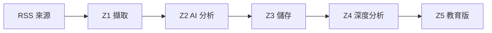

# 🤖 AI 深度情報分析報告

📅 2026-02-13 16:21 UTC
📊 分析 7 則（有效 11、無效 0）
✅ 成功率 80% ｜ ⏱️ 56.6s

🟡 部分異常，但整體仍可使用

---

## 📊 今日結論

有效新聞 11 則 ｜ 無效 0 則
主題涵蓋：Open Source 、Apple, fix m、Zed editor s
資料可信度：良好

→ 部分項目需關注

---

## 🗺️ 系統流程

---

## #1：Open Source Is Not About You (

**發生了什麼：** The only people entitled to say how open source 'ought' to work are people who r

**為什麼重要：** 此事件的潛在影響：基於「The only people entitled to say how open source 'ought' to work are 

**關注重點：** 建議持續關注：GitHub stars 與社群活躍度

---

## #1（續）事實核對 & 證據

**事實核對：**
- ✅ The only people entitled to say how open source 'ought' to w
- ✅ Just because someone open sources something does not imply t
- ✅ from inventor to community manager

**證據片段：**
- 原文：「The only people entitled to say how open source 'ought' to work ar
- → 繁中說明：此段原文表明：The only people entitled to say how open source 'ought' 
- 原文：「Just because someone open sources something does not imply they ow

---

## #1（續）行動建議 & 影響

**可執行行動：**
- 本週內：科技/技術 領域在 採用曲線 方面存在服務缺口，可探索提供相關工具或解決方案的機會 → 產出：初步評估筆記
- 本週內：基於「The only people entitled to say how open source 'ought' to w」的趨
- 本週內：「from inventor to community manager」揭示的市場缺口可作為切入點，評估補充性產品或服務的可行性 →

**直接影響：**
- 基於「The only people entitled to say how open source 'ought' t
- 「Just because someone open sources something does not imply 

---

## #2：Apple, fix my keyboard before 

**發生了什麼：** Deadline: end of WWDC 2026

**為什麼重要：** 此事件的潛在影響：基於「Deadline: end of WWDC 2026」，消費電子 領域的現有參與者需要評估相容性影響

**關注重點：** 建議持續關注：產品出貨量與市佔率變化

---

## #2（續）事實核對 & 證據

**事實核對：**
- ✅ Deadline: end of WWDC 2026
- ✅ The exact dates haven't been announced yet and this timer is
- ✅ I'll update it when Apple confirms the dates

**證據片段：**
- 原文：「Deadline: end of WWDC 2026」
- → 繁中說明：此段原文表明：Deadline: end of WWDC 2026
- 原文：「The exact dates haven't been announced yet and this timer is based

---

## #2（續）行動建議 & 影響

**可執行行動：**
- 本週內：消費電子 領域在 互操作性 方面存在服務缺口，可探索提供相關工具或解決方案的機會 → 產出：初步評估筆記
- 本週內：基於「Deadline: end of WWDC 2026」的趨勢，相關方可能需要新的解決方案來適應變化 → 產出：初步評估筆記
- 本週內：「I'll update it when Apple confirms the dates」揭示的市場缺口可作為切入點，評估補充性產

**直接影響：**
- 基於「Deadline: end of WWDC 2026」，消費電子 領域的現有參與者需要評估相容性影響
- 「The exact dates haven't been announced yet and this timer i

---

## #3：Zed editor switching graphics 

**發生了什麼：** gpui: Remove blade, reimplement linux renderer with wgpu#46758

**為什麼重要：** 此事件的潛在影響：基於「gpui: Remove blade, reimplement linux renderer with wgpu#46758」，氣候/能

**關注重點：** 建議持續關注：碳排放監測趨勢

---

## #3（續）事實核對 & 證據

**事實核對：**
- ✅ gpui: Remove blade, reimplement linux renderer with wgpu#467
- ✅ gpui: Remove blade, reimplement linux renderer with wgpu#467
- ✅ Thank you for the pull request

**證據片段：**
- 原文：「gpui: Remove blade, reimplement linux renderer with wgpu#46758」
- → 繁中說明：此段原文表明：gpui: Remove blade, reimplement linux renderer with wgpu
- 原文：「gpui: Remove blade, reimplement linux renderer with wgpu#46758refl

---

## #3（續）行動建議 & 影響

**可執行行動：**
- 本週內：氣候/能源 領域在 互操作性 方面存在服務缺口，可探索提供相關工具或解決方案的機會 → 產出：初步評估筆記
- 本週內：基於「gpui: Remove blade, reimplement linux renderer with wgpu#467」的趨
- 本週內：「Thank you for the pull request」揭示的市場缺口可作為切入點，評估補充性產品或服務的可行性 → 產出：

**直接影響：**
- 基於「gpui: Remove blade, reimplement linux renderer with wgpu#
- 「gpui: Remove blade, reimplement linux renderer with wgpu#46

---

## #4：I asked Claude Code to remove 

**發生了什麼：** Disclaimer: this is a rushed angry rant with F-bombs all over

**為什麼重要：** 此事件的潛在影響：基於「Disclaimer: this is a rushed angry rant with F-bombs all over」，政策/監管

**關注重點：** 建議持續關注：法案進展階段與投票結果

---

## #4（續）事實核對 & 證據

**事實核對：**
- ✅ Disclaimer: this is a rushed angry rant with F-bombs all ove
- ✅ I had a rough day alright
- ✅ If explicit language is an issue, please skip the read

**證據片段：**
- 原文：「Disclaimer: this is a rushed angry rant with F-bombs all over」
- → 繁中說明：此段原文表明：Disclaimer: this is a rushed angry rant with F-bombs all
- 原文：「I had a rough day alright」

---

## #4（續）行動建議 & 影響

**可執行行動：**
- 本週內：政策/監管 領域在 採用曲線 方面存在服務缺口，可探索提供相關工具或解決方案的機會 → 產出：初步評估筆記
- 本週內：基於「Disclaimer: this is a rushed angry rant with F-bombs all ove」的趨
- 本週內：「If explicit language is an issue, please skip the read」揭示的市場缺口可作為

**直接影響：**
- 基於「Disclaimer: this is a rushed angry rant with F-bombs all 
- 「I had a rough day alright」將驅動相關方重新評估現有策略與資源配置

---

## #5：CSS-Doodle

**發生了什麼：** is a special selector indicates to the component element itself

**為什麼重要：** 此事件的潛在影響：基於「is a special selector indicates to the component element itself」，科技/

**關注重點：** 建議持續關注：GitHub stars 與社群活躍度

---

## #5（續）事實核對 & 證據

**事實核對：**
- ✅ is a special selector indicates to the component element its
- ✅ Note that the styles would be over-written by your normal CS
- ✅ (try to hover on the doodle)

**證據片段：**
- 原文：「is a special selector indicates to the component element itself」
- → 繁中說明：此段原文表明：is a special selector indicates to the component element
- 原文：「Note that the styles would be over-written by your normal CSS file

---

## #5（續）行動建議 & 影響

**可執行行動：**
- 本週內：科技/技術 領域在 可擴展性 方面存在服務缺口，可探索提供相關工具或解決方案的機會 → 產出：初步評估筆記
- 本週內：基於「is a special selector indicates to the component element its」的趨
- 本週內：「(try to hover on the doodle)」揭示的市場缺口可作為切入點，評估補充性產品或服務的可行性 → 產出：初步

**直接影響：**
- 基於「is a special selector indicates to the component element 
- 「Note that the styles would be over-written by your normal C

---

## #6：Elon Musk suggests spate of xA

**發生了什麼：** At least nine engineers, including two co-founders, have announced their exits f

**為什麼重要：** 這是 人工智慧 領域的重要動態，可能對相關產業或使用者產生連鎖影響。

**關注重點：** 建議關注 人工智慧 後續的官方公告或市場回應。

---

## #6（續）事實核對 & 證據

**事實核對：**
- ✅ At least nine engineers, including two co-founders, have ann

**證據片段：**

---

## #6（續）行動建議 & 影響

**可執行行動：**
- 本週內：搜尋「Elon Musk suggests s」的最新報導，確認事件進展 → 產出：摘要筆記
- 兩週內：評估此事件對自身工作或投資的潛在影響 → 產出：風險/機會清單

**直接影響：**
- （資料不足）

---

## #7：Dutch phone giant Odido says m

**發生了什麼：** The Dutch phone giant Odido is the latest phone and internet company to be hacke

**為什麼重要：** 這是 資安/網路安全 領域的重要動態，可能對相關產業或使用者產生連鎖影響。

**關注重點：** 建議關注 資安/網路安全 後續的官方公告或市場回應。

---

## #7（續）事實核對 & 證據

**事實核對：**
- ✅ The Dutch phone giant Odido is the latest phone and internet

**證據片段：**

---

## #7（續）行動建議 & 影響

**可執行行動：**
- 本週內：搜尋「Dutch phone giant Od」的最新報導，確認事件進展 → 產出：摘要筆記
- 兩週內：評估此事件對自身工作或投資的潛在影響 → 產出：風險/機會清單

**直接影響：**
- （資料不足）

---

## #8：Amazon’s Ring cancels partners

**發生了什麼：** This news comes less than a week after Ring's Super Bowl commercial stoked contr

**為什麼重要：** 此事件的潛在影響：基於「This news comes less than a week after Ring's Super Bowl commercial 

**關注重點：** 建議持續關注：漏洞修補率與平均修補時間

---

## #8（續）事實核對 & 證據

**事實核對：**
- ✅ This news comes less than a week after Ring's Super Bowl com

**證據片段：**
- 原文：「This news comes less than a week after Ring's Super Bowl commercia
- → 繁中說明：此段原文表明：This news comes less than a week after Ring's Super Bowl

---

## #8（續）行動建議 & 影響

**可執行行動：**
- 本週內：資安/網路安全 領域在 可擴展性 方面存在服務缺口，可探索提供相關工具或解決方案的機會 → 產出：初步評估筆記
- 本週內：基於「This news comes less than a week after Ring's Super Bowl com」的趨

**直接影響：**
- 基於「This news comes less than a week after Ring's Super Bowl 
- 高關注度（熱度 7）將促使同業加速跟進或發表回應

---

## #9：Cohere’s $240M year sets stage

**發生了什麼：** Cohere surpassed $240 million in annual recurring revenue in 2025, highlighting 

**為什麼重要：** 此事件的潛在影響：基於「Cohere surpassed $240 million in annual recurring revenue in 2025, h

**關注重點：** 建議持續關注：模型基準測試排名變化

---

## #9（續）事實核對 & 證據

**事實核對：**
- ✅ Cohere surpassed $240 million in annual recurring revenue in

**證據片段：**
- 原文：「Cohere surpassed $240 million in annual recurring revenue in 2025,
- → 繁中說明：此段原文表明：Cohere surpassed $240 million in annual recurring revenu

---

## #9（續）行動建議 & 影響

**可執行行動：**
- 本週內：人工智慧 領域在 激勵設計 方面存在服務缺口，可探索提供相關工具或解決方案的機會 → 產出：初步評估筆記
- 本週內：基於「Cohere surpassed $240 million in annual recurring revenue in」的趨

**直接影響：**
- 基於「Cohere surpassed $240 million in annual recurring revenue
- 高關注度（熱度 7）將促使同業加速跟進或發表回應

---

## #10：Meta plans to add facial recog

**發生了什麼：** The feature, internally known as “Name Tag,” would allow smart glasses wearers t

**為什麼重要：** 這是 人工智慧 領域的重要動態，可能對相關產業或使用者產生連鎖影響。

**關注重點：** 建議關注 人工智慧 後續的官方公告或市場回應。

---

## #10（續）事實核對 & 證據

**事實核對：**
- ✅ The feature, internally known as “Name Tag,” would allow sma

**證據片段：**

---

## #10（續）行動建議 & 影響

**可執行行動：**
- 本週內：搜尋「Meta plans to add fa」的最新報導，確認事件進展 → 產出：摘要筆記
- 兩週內：評估此事件對自身工作或投資的潛在影響 → 產出：風險/機會清單

**直接影響：**
- （資料不足）

---

## #11：Score, the dating app for peop

**發生了什麼：** Two years ago, a controversial dating app was launched and quickly shuttered: fo

**為什麼重要：** 這是 創業/投融資 領域的重要動態，可能對相關產業或使用者產生連鎖影響。

**關注重點：** 建議關注 創業/投融資 後續的官方公告或市場回應。

---

## #11（續）事實核對 & 證據

**事實核對：**
- ✅ Two years ago, a controversial dating app was launched and q
- ✅ Now, the founder is relaunching it, open to anyone

**證據片段：**

---

## #11（續）行動建議 & 影響

**可執行行動：**
- 本週內：搜尋「Score, the dating ap」的最新報導，確認事件進展 → 產出：摘要筆記
- 兩週內：評估此事件對自身工作或投資的潛在影響 → 產出：風險/機會清單

**直接影響：**
- （資料不足）

---

## 📊 系統效能

| 指標 | 數值 |
|------|------|
| 成功率 | 80% |
| P50 延遲 | 17.2s |
| P95 延遲 | 45.8s |
| 雜訊清除 | 2 個 |

🟡 部分異常，但整體仍可使用
