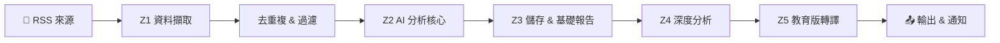
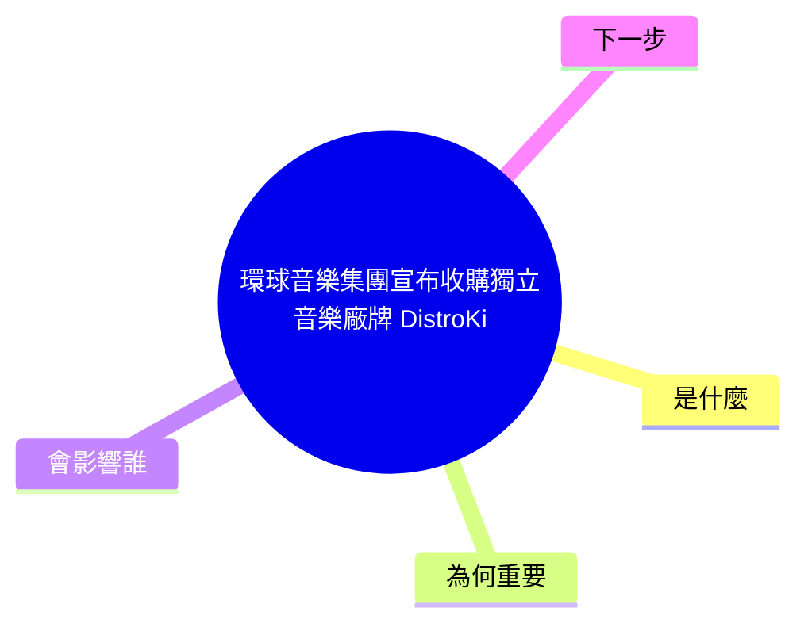

# 🤖 AI 深度情報分析報告 — 成人教學版

> 本報告將「分析師版」的深度分析結果，轉譯為不需要技術背景即可理解的版本。
> 適合：產品經理、投資人、管理層、或任何對科技趨勢好奇的讀者。

## 📋 封面資訊

| 項目 | 內容 |
|------|------|
| 報告時間 | {{TIMESTAMP}} |
| Run ID | `abc123def456` |
| 分析項目數 | 2 則（有效 1、無效 1）|
| 全文抓取成功率（Enrich Success Rate） | 75% |
| 總執行時間 | 45.6 秒 |
| 主要失敗原因 | 全文抽取品質不足（網頁內容過少或格式特殊，無法擷取完整文章）（1 次）; 被目標網站封鎖（對方的反爬蟲機制阻止了我們的存取）（1 次） |

**📖 閱讀指南：**

1. **先看**：「今日結論」— 2 分鐘掌握全貌
2. **再看**：「每則新聞卡片」— 深入了解每則事件的背景與影響
3. **最後看**：「Metrics 與運維建議」— 了解系統狀態與改善方向

---

## 📊 今日結論（Executive Summary）

本次分析共處理 2 則資料項目，其中 **1 則為有效新聞**、**1 則為無效內容**（系統訊息或抓取失敗）。

有效新聞涵蓋的主題包括：環球音樂集團宣布收購獨立音樂廠。

本批次資料可信度**中等**，約有一半以上項目成功處理，但仍有改善空間。

| 指標 | 數值 |
|------|------|
| 有效項目 | 1 則 |
| 無效項目 | 1 則 |
| 主要來源 | https://example.com/ |
| 主要主題 | 併購/企業 |


### 小問答時間

**Q：這份報告跟我有什麼關係？**

A：這份報告幫你用最短時間掌握今天科技圈發生了什麼事。就像每天早上聽廣播新聞一樣——你不需要自己去翻十幾個網站，系統已經幫你整理好重點了。

---

## ❓ 這套系統到底在做什麼（QA）

**Q1：這份報告的輸入是什麼？**

系統從多個 RSS 來源（如 TechCrunch、36kr、Hacker News）自動擷取最新文章。每篇文章經過全文抓取後，成為一個「資料項目（Item）」，也就是本報告的分析對象。

**Q2：輸出是什麼？**

系統產出四種文件：① `digest.md`（快速摘要）、② `deep_analysis.md`（分析師版深度報告）、③ 本份教育版報告、④ 選配的通知推送（Slack/飛書/Email）。每份文件服務不同讀者。

**Q3：什麼是 Pipeline（資料生產線）？**

Pipeline 就像早餐店的流水線。原始新聞從入口進來，依序經過清洗、分類、評分、深度分析等站點，最終產出結構化的報告。想像一下：有人負責煎蛋（抓資料）、有人負責夾土司（整理分類）、有人負責包裝（產生報告）。每個站點專責一項任務，如果某站出錯，不會影響其他站的運作。

**Q4：為什麼要打分數？分數代表什麼？**

系統會為每則新聞計算一個綜合分數，就像學校考試一樣——考量新穎性、實用性、熱度、可行性等維度。只有分數超過門檻（預設 7.0）的項目才會進入深度分析階段。這個機制叫做「品質關卡」，目的是把有限的運算資源集中在最有價值的內容上。

**Q5：為什麼會出現「不是新聞的字串」？**

自動化抓取時，部分網站會要求登入、顯示 Cookie 通知、或回傳 Session 過期的提示頁面。這些頁面會被抓取程式當成文章內容。本報告中，這類項目會被標記為「⚠️ 非新聞內容」，並提供具體的修復建議。

**Q6：我今天要做的最小動作是什麼？**

1. 花 2 分鐘讀完「今日結論」
2. 挑 1 則你最感興趣的新聞卡片仔細閱讀
3. 按照卡片中的「可執行行動」完成 1 個任務

---

## 🗺️ 系統流程圖



**各站說明：**

- **Z1 資料擷取（Ingestion）**：從 RSS 來源抓取文章，進行全文擷取與基本清洗。白話說：「把網路上的原始新聞抓下來」。
- **Z2 AI 分析核心（AI Core）**：對每則新聞做摘要、分類、評分、實體抽取。白話說：「讓 AI 讀完每篇文章並寫重點」。
- **Z3 儲存與交付（Storage & Delivery）**：將結果存入資料庫，生成摘要報告。白話說：「把成績記錄下來並寄出成績單」。
- **Z4 深度分析（Deep Analyzer）**：對通過品質門檻的項目做七維深度分析。白話說：「對優秀的文章做進階研究報告」。
- **Z5 教育版轉譯（Education Renderer）**：就是產出本報告的環節，把技術語言轉成易懂版本。白話說：「把研究報告翻譯成白話文」。


### 小問答時間

**Q：這個流程圖看起來好複雜，我需要懂嗎？**

A：不用全懂！你只要知道：資料從左邊進來、右邊出去，就像早餐店的流水線——有人負責煎蛋、有人負責夾土司、有人負責包裝。每一站各做各的事，最後你拿到的就是一份完整的早餐（報告）。

---

## 📰 今日新聞卡片

### 第 1 則：環球音樂集團宣布收購獨立音樂廠牌 DistroKid

#### 摘要

- **發生了什麼：** 環球音樂宣布收購 DistroKid
- **為什麼重要：** 此事件的潛在影響：獨立音樂人的發行管道可能受影響
- **你要關注什麼：** 建議關注 併購/企業 後續的官方公告或市場回應。

#### 事實核對（Fact Check）

- ✅ 環球音樂以 12 億美元收購 DistroKid
- ⚠️ （本次資料範圍內無需額外驗證的項目）

#### 證據片段（Evidence Snippets）

- 原文：「Universal Music Group announced acquisition of DistroKid for $1.2B」
- → 繁中說明：此段原文表明：Universal Music Group announced acquisition of DistroKid for $1.2B
- 原文：「The deal consolidates independent music distribution」
- → 繁中說明：此段原文表明：The deal consolidates independent music distribution

#### 技術/商業解讀

本事件涉及 併購/企業 領域。核心要點包括：環球音樂宣布收購 DistroKid；交易金額 12 億美元；將整合音樂發行網絡。從產業鏈角度來看，這類事件通常會影響上下游的合作關係與競爭格局，值得持續追蹤後續的市場反應與政策回應。 綜合來看，此事件在 併購/企業 具有指標性意義，後續發展方向取決於各方利害關係人的回應速度與策略調整。

> 💡 **類比理解：** 就像兩家公司合併部門——表面上是資源整合，實際上涉及團隊文化磨合與客戶遷移

#### 二階效應（Second-order Effects）

| 類型 | 影響 | 觀察指標 |
|------|------|----------|
| 直接影響 | 獨立音樂人的發行管道可能受影響 | 觀察 獨立音樂人的發行管道可能受影響 的後續發展 |

#### 可執行行動（Actions）

- 本週內：獨立音樂發行領域可能出現新競爭者 → 產出：初步評估筆記

#### 媒體與延伸資源

- 🖼️ 企業併購關係圖｜關鍵字：併購/企業 環球音樂集團宣布收購獨立音樂廠｜用途：PPT 封面或 Notion 配圖
- 🖼️ 資訊圖表（Infographic）｜關鍵字：環球音樂集團宣布收購獨立音樂廠 數據視覺化｜用途：社群分享
- 🎬 YouTube 搜尋：「環球音樂集團宣布收購獨立音樂廠牌 Dis 併購 企業 分析解讀」
- 🎬 YouTube 搜尋：「併購 企業 趨勢 {{YEAR}} 中文」
- 📎 Google 搜尋：「環球音樂集團宣布收購獨立音樂廠牌 Dis 產業分析」
- 📎 Google 搜尋：「併購/企業 最新動態 {{YEAR}}」
- 🔗 **原始連結：** https://example.com/music-acquisition


### 圖解理解


### 延伸影片

https://www.youtube.com/results?search_query=環球音樂集團宣布收購獨立音樂廠牌+DistroKid+explained


### Notion 學習任務

- 今日學到：
- 這對我有何影響：
- 下一步行動：


#### 心智圖




### 小問答時間

**Q：「環球音樂集團宣布收購獨立音樂廠牌 Dis」這件事跟一般人有什麼關係？**

A：你可以把它想成工廠裡某條生產線換了新機器——短期內工人要重新學習操作，但長期來看產量會增加。「環球音樂集團宣布收購獨立音樂廠牌 Dis」也是類似的道理：現在看起來只是產業新聞，但未來可能影響到你用的產品或服務的價格和品質。


---

### 第 2 則：⚠️ 無效內容

> **判定：此項目為無效內容，並非真實新聞。**

**說明：** 此項目並非有效新聞內容。系統在抓取過程中，將網站的系統提示（如登入頁面、Session 過期通知）誤判為新聞。

**可能原因：** blocked / extract_low_quality — 目標網站要求登入或觸發了反爬蟲機制

**修復建議：** 可調整抓取策略（如更換 User-Agent、增加重試邏輯）或將該來源加入排除清單

**原文片段：**

- 原文片段：「You signed in with another tab or window. Reload to refresh your session. You signed out in another tab or window. Reloa」
- → 繁中說明：這些文字屬於網站的 Session 管理提示，不包含任何新聞資訊。


---

## 📊 Metrics 與運維建議

### 健康度儀表板

| 指標 | 數值 | 解讀 | 建議門檻 |
|------|------|------|----------|
| Enrich Success Rate | 75% | 一般：約半數項目處理成功，部分來源可能有問題 | ≥ 80% |
| Top Fail Reasons | 見下 | 全文抽取品質不足（網頁內容過少或格式特殊，無法擷取完整文章）×1; 被目標網站封鎖（對方的反爬蟲機制阻止了我們的存取）×1 | 無失敗為最佳 |
| Latency P50 | 5.2s | 正常 | < 10s |
| Latency P95 | 12.8s | 正常 | < 30s |
| Total Runtime | 45.6s | — | 依資料量而定 |
| Entity Noise Removed | 3 | 已清除部分雜訊實體 | — |


### 🟡 總體評估：部分異常，但整體仍可使用

### 排錯指引

**🔍 快速：查看最近的錯誤 log**

```powershell
# PowerShell
Select-String -Path ".\logs\app.log" -Pattern "ERROR|WARN" | Select-Object -Last 20
```

```bash
# Bash
grep -E "ERROR|WARN" logs/app.log | tail -20
```

**🔧 中等：篩選特定階段的 log**

```powershell
# 查 Z5 教育版相關
Select-String -Path ".\logs\app.log" -Pattern "Z5|education|Education"
# 查抓取失敗
Select-String -Path ".\logs\app.log" -Pattern "enrich.*fail|blocked|timeout"
```

```bash
grep -iE "Z5|education" logs/app.log
grep -iE "enrich.*fail|blocked|timeout" logs/app.log
```

**🛠️ 深入：重跑或調整來源**

```powershell
# 關閉特定來源（在 .env 中修改 RSS_FEEDS_JSON）
# 或調低品質門檻做測試
# GATE_MIN_SCORE=5.0 python scripts\run_once.py
```

### 下一 Sprint 建議

1. **提高抓取成功率**：檢查 `core/ingestion.py` 中的重試邏輯與 User-Agent 設定
2. **降低 P95 延遲**：在 `core/ai_core.py` 中增加連線池或並行處理
3. **改善實體清洗**：擴充 `utils/entity_cleaner.py` 中的規則，減少 false positive
4. **來源品質監控**：為每個 RSS 來源建立獨立的成功率追蹤（可在 `utils/metrics.py` 擴充）
5. **教育版內容深度**：根據讀者回饋調整 `core/education_renderer.py` 中的解讀模板


### 小問答時間

**Q：系統健康數字是什麼意思？我需要擔心嗎？**

A：這些數字就像學校考試成績一樣——80 分以上算不錯，50 分以下就要注意了。如果你只是看報告的人，不需要擔心；如果你是管理者，紅燈時要請工程師檢查。

---

## 📚 下一步學習

恭喜你讀完今天的科技趨勢教學！以下是建議的學習路徑：

1. **今天**：挑一則最感興趣的新聞，用自己的話說給朋友聽
2. **本週**：完成至少一張新聞卡片裡的「Notion 學習任務」
3. **本月**：回顧過去幾期報告，找出重複出現的趨勢關鍵字

> 學習科技趨勢就像每天看天氣預報——不需要懂氣象學，但知道明天會不會下雨，能幫你決定要不要帶傘。

---

*本報告由 AI Intel Education Renderer (Z5) 自動生成｜深度等級：adult*